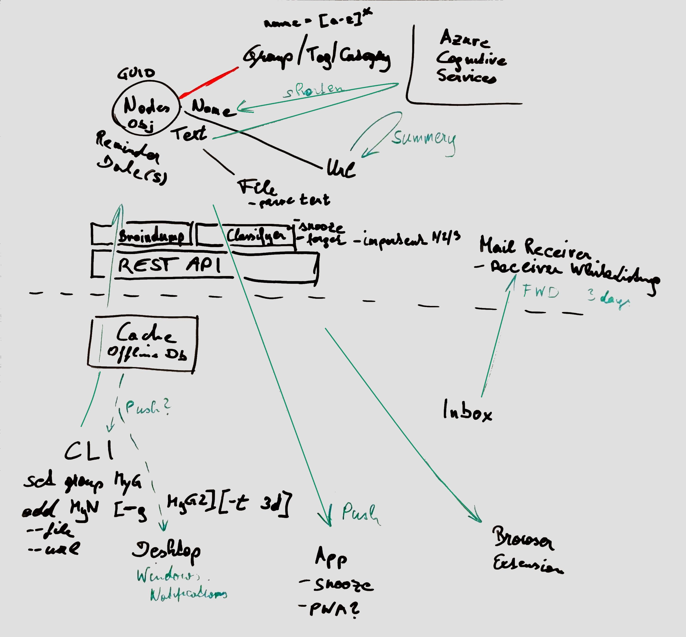

[](https://dev.azure.com/zoechbauer/Nudelsieb/_build/latest?definitionId=2&branchName=master)

*Nudelsieb* is a service that enables one to quickly write down thoughts and ideas before having forgotten them already.

*Nudelsieb* is work in progress.

# Installation

[](https://chocolatey.org/packages/nudelsieb-cli)
[](https://chocolatey.org/packages/nudelsieb-cli)

You can install the CLI via the Windows package manager [Chocolatey](https://chocolatey.org/packages/nudelsieb-cli):

`choco install nudelsieb-cli`

# Usage


After the installation with Chocolatey you can use the CLI with the these aliases: `nudelsieb` or the short version `nds`.

A random thought that occurred to you is called a *neuron*. To add a new neuron, simply run

```
nudelsieb add "My random thought I want to remember"
```

If you want to order your thought into *groups*, run 
```
nudelsieb add "My random thoughts I want to remember" --group "work" --group "support"
```

To retrieve or remember your thoughts, run
```
nudelsieb get --group "work"
```

# Architecture

The following architecture sketch illustrates the big picture:


See the Swagger specification of our REST API at https://nudelsieb.zoechbauer.dev/swagger.

# Setup instructions for local development
Install [Azure Cosmos Emulator](https://aka.ms/cosmosdb-emulator) (currently, no Docker image for Linux is available). Per default the emulator is listening on localhost:8081.
